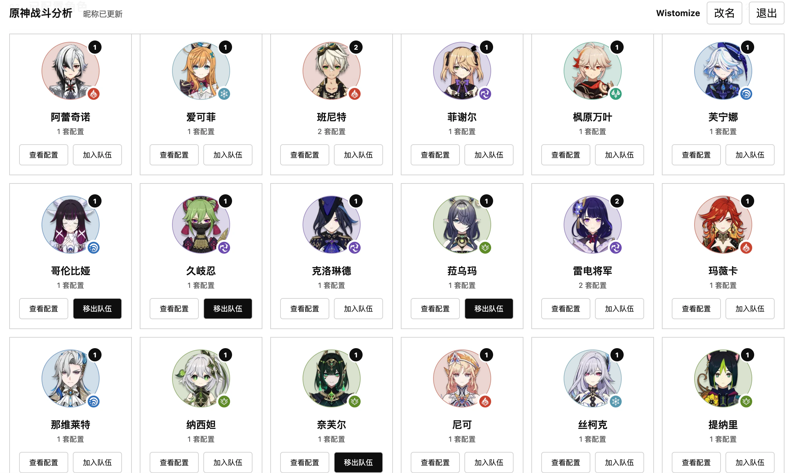
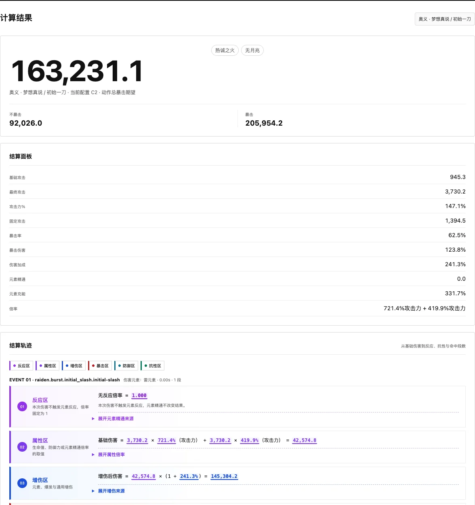
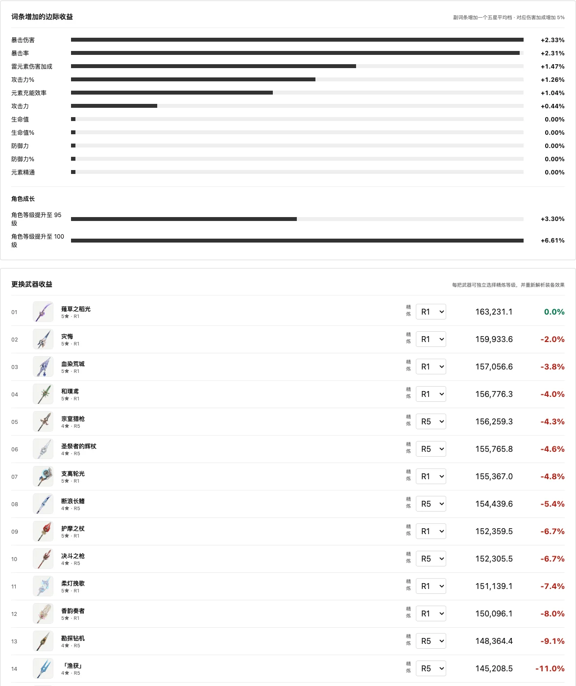

# GSCombat

**原神角色数据与战斗伤害分析工具**

[在线使用](https://gscombat.online) · [English](README.en.md) ·
[问题反馈](https://github.com/Wistomize/gscombat/issues) · [外部资料与致谢](docs/third-party-sources.md)

GSCombat（原神战斗分析爽）用来回答一个比“这件圣遗物多少分”更实际的问题：

> 在当前角色、武器、圣遗物和队伍配置下，这个技能能造成多少伤害？换一把武器或增加一个词条，究竟能提升多少？

配置好角色与队伍，选择想考察的技能或辅助指标，GSCombat 会给出期望结果、最终面板、完整公式轨迹、
圣遗物词条边际收益和武器更换收益。计算过程按乘区展开，尽量让每一项加成都能找到来源，而不是只留下一个黑盒分数。

_从已有角色配置组成 1–4 人队伍，队伍坑位没有固定顺序语义。_

## 它能帮你做什么

### 分析角色的目标伤害

- 选择角色的普攻、重击、元素战技、元素爆发或专属机制作为计算指标；
- 计算无反应伤害，以及蒸发、融化、激化、剧变、月曜和星烁等适用反应；
- 处理攻击力、生命值、防御力、元素精通等不同倍率，以及暴击、增伤、抗性、防御和特殊反应乘区；
- 展开多段伤害，并标明天赋、命座、武器、圣遗物、队友和 Buff 分别贡献了什么。

### 分析辅助角色的能力

辅助角色不需要用伤害证明自己。班尼特可以看领域加攻和单跳治疗，钟离可以看护盾量，其他角色也可以使用
治疗、护盾、属性加成或伤害加成等独立指标。每个指标同样保留计算公式和生效条件。

### 找到更有效的提升方向

- 查看每种圣遗物副词条对当前目标指标的边际收益；
- 按当前词条收益换算五件圣遗物的有效词条数；
- 对比角色等级、天赋等级和元素伤害加成的提升；
- 比较同类武器在当前配置中的收益，并应用可稳定达到的武器效果；
- 查看原始圣遗物输入，核对最终结果是否来自你实际使用的配置。

## 如何使用

1. **准备角色配置**：通过 UID 导入游戏展示柜、导入 GSCombat JSON，或手动创建角色配置。
2. **组成队伍**：从已配置角色中选择 1–4 名成员；队伍槽位没有固定顺序语义。
3. **选择计算对象**：指定队伍中的一名角色，再选择要计算的伤害或辅助指标。
4. **设置战斗场景**：调整敌人等级、抗性和 Buff。默认敌人为 100 级、全抗性 10% 的木桩。
5. **开始计算**：依次查看指标结果、结算面板、结算轨迹、有效词条、边际收益和武器更换收益。

[打开 GSCombat](https://gscombat.online)

## 如何理解计算结果

_雷罚恶曜之眼和班尼特领域生效时，雷电将军初始一刀的期望结果与逐乘区结算轨迹。_

### 指标期望结果

这是本次计算最终要比较的数值。伤害指标通常是一个开发者维护的核心动作，例如香菱旋火轮单次蒸发、
那维莱特重击衡平推裁或特殊反应的一次指定伤害；辅助指标则可能是治疗量、护盾量或加攻值。

### 结算面板与结算轨迹

结算面板展示技能实际使用的攻击力、生命值、防御力、元素精通和双暴等属性。结算轨迹继续把倍率、暴击、
增伤、反应、抗性、防御及特殊乘区逐层展开，并列出圣遗物主属性、套装效果、天赋、命座和队友效果等来源。

### 边际收益

边际收益不是固定权重。GSCombat 会保持当前角色、队伍、敌人和 Buff 不变，只增加一个词条或替换一把武器，
再重新计算同一个目标指标。暴击率达到 100% 后不会继续产生暴击收益，其他带上限或条件的属性也按实际状态结算。

_在当前角色、队伍与目标指标不变时，比较一个平均词条和不同武器带来的实际提升。_

## 为什么不使用固定圣遗物评分

同一个词条的价值会随角色、武器、队伍、反应和当前面板改变。攻击力对一个角色可能很重要，对生命倍率角色可能
几乎无效；暴击率在不足时很有价值，达到 100% 后则不再提升期望伤害。

因此 GSCombat 不把所有角色塞进同一套“双暴分”公式，而是围绕当前配置和目标动作计算：

- **现在能打多少**：目标动作或辅助指标的期望结果；
- **提升多少**：增加词条、升级角色或天赋、更换武器后的相对变化；
- **为什么**：属性来源、生效条件和完整乘区公式。

## 配置保存与多端同步

- **不使用邀请码**：配置只保存在当前浏览器中，可以通过导入、导出整个工作空间自行备份和迁移；
- **使用邀请码**：配置保存到邀请码对应的独立 SQLite 工作空间，可在多个浏览器或设备间同步；
- **展示柜导入**：通过第三方公开展示柜数据生成角色配置，不需要提供游戏账号或密码。

邀请码本质上是工作空间凭据，请只分享给你信任的人。没有邀请码时请及时导出个人数据，避免浏览器缓存被清理后丢失。

## 当前范围与限制

GSCombat 当前聚焦于**单个核心动作的期望结果**，不是完整循环 DPS 模拟器。技能释放时机、前后摇、用户操作、
随机行动顺序和复杂轴长尚未统一进入循环模型。

武器、圣遗物、命座、固有天赋、队友增益、队伍共鸣和特殊反应由项目逐项维护。新版本机制或尚未审阅的复杂交互
可能暂时不完整；如果结果明显不合理，欢迎附上角色配置、队伍、目标指标和结算轨迹提交问题。

当前内置《原神》7.0 固定数据快照：119 名角色、247 把武器、63 套圣遗物。运行时不会为静态游戏数据调用外部 API；
展示柜导入是独立的可选功能。

## 反馈、许可与声明

- 使用中发现问题或希望补充机制：[提交 Issue](https://github.com/Wistomize/gscombat/issues)
- 原创代码按 [GNU Affero General Public License v3.0](LICENSE) 发布
- 游戏数据、图片、文本与外部资料来源：[外部资料与致谢](docs/third-party-sources.md)

本项目是非官方社区项目，与米哈游／HoYoverse 无隶属或认可关系。“原神”、角色、武器、圣遗物、图像和相关素材
的权利归其各自权利人所有。计算结果应视为社区工具推导值，不代表游戏官方结论。

## 开发与贡献

仓库结构、本地开发、Content 声明、数据更新、测试和部署说明已移至
[GSCombat 开发指南](docs/development.md)。架构决策记录位于 [`docs/adr`](docs/adr)，生产部署流程见
[腾讯云部署说明](docs/deployment/tencent-cloud.md)。
