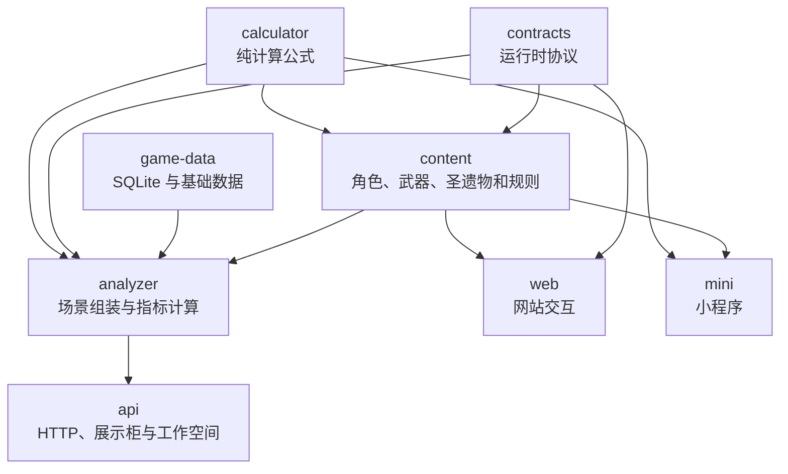

# GSCombat 架构问题台账与纯结构重构计划

- 状态：执行中
- 建立日期：2026-08-06
- 适用仓库：`gscombat`
- 目标分支：`main`

## 1. 文档定位

本文记录当前仓库已经确认的架构问题、代码归属问题和结构性风险，并作为后续重构的逐项验收台账。

本文不是最终的 `architecture.md`。在台账中的结构问题处理完毕之前，提前编写完整架构文档只会把目标设计误写成当前事实。全部问题完成后，再根据实际代码编写中英文架构说明。

本文也不是功能路线图。伤害公式、角色逻辑、武器和圣遗物效果、页面交互需求不在本轮纯结构重构范围内。

### 1.1 与现有文档的关系

- `docs/adr/` 继续记录已经做出的关键架构决策；除非新 ADR 明确取代，现有 ADR 仍然有效。
- `docs/plans/2026-08-03-gscombat-repository-consolidation.md` 和其他历史计划保留为设计过程记录。
- 本文是当前结构治理的唯一进度台账；历史计划中的任务状态不再代表当前完成度。
- 最终的 `docs/architecture.md` 和 `docs/architecture.en.md` 只描述重构完成后的实际架构，不复制本文的问题清单。

## 2. 重构约束

### 2.1 必须保持的行为

- 正式伤害指标、辅助指标、结算面板、结算轨迹和边际收益的数值及语义保持不变。
- `/v1/analysis`、`/v1/support-metrics/evaluate`、展示柜导入和工作空间接口保持兼容。
- 浏览器中的配置、入队、指标选择和计算流程保持不变。
- SQLite 数据结构和现有工作空间数据保持兼容。
- 角色、武器、圣遗物的标识符和已发布效果标识符保持稳定。

### 2.2 实施原则

- 一次只处理一个架构问题；每项独立验证、独立提交，并在本文更新状态。
- 优先移动职责和建立边界，不在结构提交中顺手修改公式。
- 以 API 和页面集成测试为主要回归保障，避免为文件移动新增大量角色级碎片测试。
- 不以文件行数作为唯一拆分依据；生成文件允许很大，手工维护且横跨多个职责的文件才是主要风险。
- 不引入微服务、消息队列、额外数据库或没有当前消费者的新包。
- 删除接口、改变小程序行为等非纯结构事项必须单独确认，不能混入重构提交。

### 2.3 每项通用完成定义

- TypeScript 类型检查通过。
- 相关包测试和关键 API 集成测试通过。
- 现有公开导出和 HTTP 契约未发生未经批准的变化。
- 没有新增跨包相对路径导入、包循环依赖或角色特判泄漏。
- 文件移动后旧实现已删除，不保留双份实现或临时兼容层。
- 本文中对应问题的状态、实际处理结果和验证命令已更新。

## 3. 当前架构快照

当前仓库属于模块化单体，生产依赖方向总体成立：



截至本文建立时，CodeGraph 索引包含约 1085 个文件、5987 个符号和 12235 条关系。包之间没有发现依赖环。

### 3.1 目录职责评价

| 目录 | 当前职责 | 当前评价 |
| --- | --- | --- |
| `packages/calculator` | 伤害、反应和循环等纯公式 | 边界干净，优先保持稳定 |
| `packages/contracts` | TypeBox 请求、响应和领域协议 | 放置正确，文件可按资源继续整理 |
| `packages/game-data` | SQLite、快照、数据源和本地化 | 当前最干净的包之一 |
| `packages/content` | 角色、武器、圣遗物和规则声明 | 实体局部化方向正确，中央登记文件膨胀严重 |
| `packages/analyzer` | 场景、效果选择、指标和收益分析 | 概念边界正确，内部扁平且存在少量角色泄漏 |
| `apps/api` | Fastify、工作空间、展示柜和序列化 | I/O 归属正确，组合根过大 |
| `apps/web` | 配置工作空间和计算结果展示 | 功能完整，页面组件承担职责过多 |
| `apps/mini` | Taro 小程序 | 明确暂停独立功能，仅保留不运行计算的最小壳 |
| `docs` | ADR、部署和历史设计计划 | 历史决策完整，缺少反映当前事实的活架构文档 |

### 3.2 规模热点快照

以下数字用于识别职责风险，不作为强制行数限制：

| 文件 | 约行数 | 判断 |
| --- | ---: | --- |
| `packages/content/src/equipment-coverage-ledger.ts` | 6994 | 手工中央账本，高风险 |
| `packages/analyzer/src/declared-scenario.ts` | 3324 | 多种求值职责混合，高风险 |
| `packages/analyzer/src/combat-registry-integrity.ts` | 2441 | 多类审计混合，中高风险 |
| `apps/web/app/workbench.tsx` | 2301 | UI、状态和请求编排混合，高风险 |
| `packages/analyzer/src/action-effects.ts` | 1499 | 选择、解析和聚合混合，高风险 |
| `packages/content/src/reviewed-multi-scaling-evidence.ts` | 1478 | 跨角色集中维护，中高风险 |
| `packages/analyzer/src/metric.ts` | 1265 | 多种指标求值混合，中高风险 |
| `packages/content/src/combat/types.ts` | 1068 | 核心类型集中，中风险 |
| `packages/calculator/src/rotation.ts` | 972 | 较大但仍相对内聚，低优先级 |
| `apps/api/src/app.ts` | 920 | 路由和应用装配混合，中高风险 |
| `apps/web/app/configuration-workspace.tsx` | 879 | 工作空间多类职责混合，高风险 |

以下大文件是生成产物，不因体积本身进入拆分范围：

- `apps/api/src/showcase-metadata.generated.ts`
- `packages/content/src/equipment-inventory.generated.ts`
- `apps/web/lib/visual-assets.generated.json`

## 4. 问题台账

状态取值：`待处理`、`进行中`、`已完成`、`暂缓`、`需决策`。

| ID | 优先级 | 状态 | 问题 |
| --- | --- | --- | --- |
| ARCH-001 | P0 | 已完成 | 正式指标引擎与 Foundation 示例形成并行计算链路 |
| ARCH-002 | P0 | 已完成 | Analyzer 和 API 中残留具体角色知识 |
| ARCH-003 | P0 | 已完成 | Content 中央注册表和覆盖账本成为人工维护热点 |
| ARCH-004 | P1 | 已完成 | Analyzer 内部目录扁平且核心文件职责过多 |
| ARCH-005 | P1 | 已完成 | Web 巨型组件混合领域状态、请求和展示 |
| ARCH-006 | P1 | 已完成 | API `app.ts` 承担过多路由与序列化职责 |
| ARCH-007 | P1 | 待处理 | Catalog 投影重复且 Content 根导出面过宽 |
| ARCH-008 | P2 | 待处理 | Contracts 文件按技术形态聚集，资源边界不够清楚 |
| ARCH-009 | P1 | 已完成 | Mini 仍依赖早期 Foundation 模型，状态不明确 |
| ARCH-010 | P1 | 待处理 | 缺少自动化架构边界守卫和当前架构文档 |

### ARCH-001：并行计算链路

**处理前现状**

- 正式计算链路以 `/v1/analysis`、`evaluateCombatMetric` 和 `evaluateScenario` 为核心。
- `packages/content/src/playstyles/raiden-national/preset.ts` 仍通过早期 `Modifier[]` 组装示意伤害。
- `apps/api/src/app.ts` 中的 `/v1/evaluations` 仍暴露早期计算入口。
- `apps/mini/src/pages/index/index.tsx` 仍直接使用 Foundation 示例。

**风险**

- 同一个仓库存在两套“看起来都能计算”的模型，维护者无法快速判断哪个是权威入口。
- 旧链路可能绕过角色声明、队伍效果和当前场景引擎。
- 继续保留会迫使后续结构同时兼容两种抽象。

**目标**

- 正式产品只有一条权威指标计算链路。
- 历史示例若仍需保留，应明确隔离为测试夹具或文档示例，不能作为生产 API。

**完成条件**

- 明确 `/v1/evaluations` 的兼容需求和废弃策略。
- 生产入口不再调用示意 `Modifier[]` 预设。
- Mini 后续接入正式 API，或明确标记为暂停维护并从默认流程隔离。
- 早期实现无生产调用后再删除。

**注意**

此项可能改变公开接口和小程序行为，不属于未经确认即可执行的纯结构调整。

**处理记录**

- 处理日期：2026-08-06
- 提交：本轮架构整理提交
- 实际变更：删除 `/v1/evaluations`、Foundation 请求响应契约、雷国示意 fixture、`playstyles/raiden-national`、示意 Modifier、雷神旧 action/helper 和 Mini 本地算伤入口。
- 权威入口：伤害指标只通过 `/v1/analysis`，辅助指标只通过 `/v1/support-metrics/evaluate`；两者都使用正式指标注册表、场景规范化和 Analyzer。
- 保留内容：Calculator 的 `evaluateExpectedDamage` 是正式直伤求值器的底层纯函数；`/v1/presets` 返回的雷国预设是正式 `EvaluationScenario`，两者都不是第二条产品链路。
- 兼容处理：不保留旧接口兼容层，调用 `/v1/evaluations` 明确返回 404；决策记录在 ADR 0014。
- 验证：`pnpm typecheck` 13 个任务；Content 35 个测试文件、139 项；Analyzer 49 个测试文件、374 项；API 14 个测试文件、134 项；Contracts 6 个测试文件、41 项；Web 6 个测试文件、19 项；`pnpm build` 8 个包，全部通过。
- 遗留项：无。

### ARCH-002：具体角色知识泄漏到通用层

**处理前现状**

- `packages/analyzer/src/team-state.ts` 直接判断 `Xilonen`。
- `packages/analyzer/src/scenario.ts` 重复定义雷神和班尼特效果 ID。
- `apps/api/src/action-effect-options.ts` 直接拼装雷神和班尼特效果选项。
- 相应角色和规则在 `packages/content` 中已经存在声明，形成重复来源。

**风险**

- 新增类似角色时需要修改 Analyzer 或 API。
- 同一机制的标识符和触发条件可能在多层漂移。
- 通用执行器逐渐退化为角色分支集合。

**目标**

- 角色和角色特有规则只在 `packages/content/src/characters` 或 `packages/content/src/rules` 中声明。
- Analyzer 只消费类型化声明，不直接认识角色 ID。
- API 只投影 Content 提供的可选效果，不手写角色选项。

**完成条件**

- Analyzer 非测试代码中不再出现无白名单的具体角色 ID。
- API 的动作效果选项从 Content 声明生成。
- 效果 ID 只有一个定义来源。
- 相关队伍集成测试证明行为和轨迹不变。

**处理记录**

- 处理日期：2026-08-06
- 提交：本轮架构整理提交
- 实际变更：角色声明新增 `scenarioEffectOptions`；雷神和班尼特在各自 `combat.ts` 中拥有场景状态，Content 统一投影 API 选项；夜魂独立触发判断收回 Content 规则层。
- 兼容处理：Analyzer 根入口继续以旧名称重新导出 Content 的权威效果常量，未复制常量值；HTTP 请求和响应保持不变。
- 架构守卫：新增 Analyzer 生产代码角色 ID 扫描，只允许 Traveler 变体和注册完整性校验两个有说明的例外。
- 验证：`pnpm typecheck`；Content 36 个测试文件、140 项；Analyzer 49 个测试文件、374 项；受影响 API 3 个测试文件、94 项真实 Fastify 注入，全部通过。
- 遗留项：无。

### ARCH-003：中央注册表和覆盖账本膨胀

**处理前现状**

- `combat-registry.ts` 集中导入全部角色。
- `combat-action-effects.ts` 集中导入大量武器和圣遗物。
- `equipment-coverage-ledger.ts` 手工维护所有装备的覆盖信息。
- `reviewed-multi-scaling-evidence.ts` 集中维护跨角色倍率证据。
- `catalog.ts` 维护部分角色动作的展示名称。
- `prospectors-shovel` 和 `blackmarrow-lantern` 两个武器目录缺少统一的 `index.ts`。

**风险**

- 新增一个实体需要同时修改实体目录和多个中央文件。
- 重复的 ID、名称和覆盖状态容易失配。
- 合并冲突会随着角色和装备数量增长而持续增加。

**目标目录模型**

```text
packages/content/src/
├── characters/<id>/
│   ├── definition.ts
│   ├── combat.ts
│   ├── evidence.ts        # 可选
│   └── index.ts
├── weapons/<id>/
│   ├── effects.ts
│   ├── coverage.ts        # 可选
│   └── index.ts
├── artifacts/<id>/
│   ├── effects.ts
│   ├── coverage.ts        # 可选
│   └── index.ts
├── rules/
├── catalog/
└── registry/              # 由工具生成聚合文件
```

**完成条件**

- 每种实体具有统一的目录契约。
- 覆盖状态、证据和展示元数据由实体自身拥有，或明确归入通用规则。
- 中央注册表通过确定性脚本生成，不使用运行时目录扫描。
- 生成器具有新鲜度校验；提交过期注册表时测试失败。
- Content 根入口只导出稳定公共 API，不逐一暴露所有内部实体模块。

**处理记录**

- 处理日期：2026-08-06
- 提交：本轮架构整理提交
- 实体目录：117 个角色目录统一拥有 `definition.ts`、`combat.ts`、`index.ts`，其中 24 个角色自有
  `evidence.ts`；234 把武器和 61 套圣遗物全部拥有 `effects.ts`、`coverage.ts`、`index.ts`。
- 覆盖账本：原 6994 行中央文件缩为 91 行发布门面；295 个审阅记录原样迁入实体目录，没有当前核心动作
  效果的装备使用类型化空效果数组。治疗和受益者装备规则从伪圣遗物目录迁入 `rules/equipment/`。
- 证据与展示：37 条多倍率证据迁回 24 个角色；117 项官方中文展示元数据和 33 个特殊动作展示名迁入角色
  definition。`reviewed-multi-scaling-evidence.ts` 与 `catalog-presentation.ts` 只保留稳定门面。
- 聚合方式：`tools/generate-registries.ts` 使用 TypeScript AST 生成 5 份显式静态 import 注册表；
  `registries:check` 接入 Content 的 build、test、typecheck，运行时不扫描目录。
- 公共边界：Content 根 `index.ts` 从逐实体通配导出缩为稳定查询、领域类型、规则、内置配置和两个兼容效果
  常量；`catalog.ts` 缩为目录实现的两行稳定门面。
- 等价验证：迁移前保存 2.84 MB 完整投影基线；角色覆盖、410 个动作、198 个指标、1090 个效果、295 个
  覆盖记录、37 条证据和三个公开目录按 ID 归一化后逐项完全一致。
- 自动验证：Content 36 个测试文件、142 项通过；`pnpm test` 全仓通过；`pnpm typecheck` 13 个任务通过；
  `pnpm build` 8 个包通过；`git diff --check` 通过。
- 架构决策：见 ADR 0015；维护步骤已写入中英文 README。
- 遗留项：无。后续目录拆分属于 ARCH-004 至 ARCH-008，不在本项继续展开。

### ARCH-004：Analyzer 内部结构过于扁平

**现状**

- `declared-scenario.ts` 同时处理来源属性、快照、直伤、剧变、月曜、星反应、时间线和反应解析。
- `action-effects.ts` 同时处理资格判断、来源选择、值解析、可达上限和聚合。
- `metric.ts` 同时处理伤害、治疗、标量和属性增益指标。
- `combat-registry-integrity.ts` 同时承担多类声明审计。
- 生产模块和大量角色集成测试混放在 `src` 根目录。

**目标目录模型**

```text
packages/analyzer/
├── src/
│   ├── core/
│   ├── effects/
│   ├── scenario/
│   ├── evaluators/
│   ├── metrics/
│   ├── analysis/
│   └── audit/
└── test/
    └── integration/
        └── characters/
```

**边界要求**

- `core` 提供构建和属性上下文，不依赖具体求值器。
- `effects` 负责效果选择、解析和聚合。
- `scenario` 负责队伍、敌人、Buff 和时间线输入的规范化。
- `evaluators` 按直伤、剧变、月曜、星反应等计算模型拆分。
- `metrics` 按伤害、治疗、标量和属性增益拆分，并共享统一来源属性解析。
- `audit` 只验证声明完整性，不参与正式计算。

**完成条件**

- 入口函数名称和对外签名保持稳定，或通过薄转发维持兼容。
- 模块依赖方向单向，不产生 `evaluators` 与 `scenario` 的循环依赖。
- 角色集成测试仍在 Analyzer 包内，但不再散落在生产模块旁边。
- 代表性直伤、辅助、月曜和星反应集成结果完全一致。

**处理记录**

- 处理日期：2026-08-06
- 提交：本轮架构整理提交
- 生产目录：原 `src` 根目录的 17 个生产文件重组为 44 个职责模块；`src` 根目录只保留稳定公开门面 `index.ts`。
- 测试目录：49 个测试文件全部迁入包级 `test/`，按 `system` 与 `integration/{analysis,characters,core,effects,evaluators,metrics,reactions,scenario}` 分类；`src` 中不再存在测试文件。当前测试都需要注册内容或固定数据库，因此没有为了填目录而制造伪单元测试。
- 求值拆分：直伤、剧变反应和月曜/星反应分别进入 `evaluators/direct.ts`、`transformative.ts` 和 `special-reaction.ts`；来源属性、手动场景参数、共享上下文和公开类型独立维护。
- 效果拆分：效果类型、来源选择、值解析、最终属性转换和聚合协调分离；`action-effects.ts` 不再拥有所有效果职责。
- 指标拆分：伤害、治疗、标量、属性增益分别求值，共用公式树、运行时来源上下文和类型；公开入口仍为 `evaluateCombatMetric`。
- 审计拆分：指标、元素覆盖、动作内在效果、伤害声明和时间线审计分别维护；`registry-integrity.ts` 仅负责注册表遍历与各审计器编排。
- 兼容性：重构前后 `dist/index.d.ts` 的 70 个根导出名称完全一致，没有公开子路径或临时兼容文件。
- 架构守卫：系统测试强制 `src` 根目录单门面、生产代码不依赖测试/审计反向层、`core` 不依赖高层、求值器不反向导入场景编排器、生产依赖图无环，并继续检查通用层角色 ID 泄漏。
- 验证：Analyzer 49 个测试文件、377 项全部通过；关键 API 5 个文件、90 项真实 Fastify 注入通过；API 全量 14 个文件、134 项在原并行配置和显式串行配置下均通过；根级 `pnpm test` 12/12 任务通过；全仓类型检查 13/13 任务和构建 8/8 任务通过；`git diff --check` 通过。
- 并发说明：第一次 `pnpm test` 的 Turbo 跨包并发运行使 4 个 API 文件触发既有 20/30 秒超时，但同轮其他包及 Analyzer 全绿；随后 API 原并行配置 134/134、4 个超时文件串行 14/14、根级 `pnpm test` 12/12 均通过，确认不是断言、数值或结构回归。本项没有夹带修改测试时限或生产性能。
- 遗留项：`evaluators/shared.ts` 仍是最大的手工模块，但只承载三种求值器共享的公式装配原语，不再包含公开求值入口；后续只有出现可独立验证的新共享边界时才继续拆分，不以行数为目标。

### ARCH-005：Web 巨型组件

**现状**

- `workbench.tsx` 混合格式化、公式树、轨迹、圣遗物编辑、Build 编辑、效果控制、API 请求和全部报告区域。
- `configuration-workspace.tsx` 混合导入、云端会话、昵称、配置库、队伍配置和页面导航。
- CSS 已按区域拆分，但 TSX 组件边界没有同步完成。

**目标目录模型**

```text
apps/web/
├── app/                 # Next.js 路由组合
├── components/ui/       # 无业务所有权的共享视觉组件
├── features/
│   ├── build-library/
│   ├── build-editor/
│   ├── party/
│   ├── workspace-session/
│   ├── calculation-setup/
│   └── calculation-report/
├── lib/                 # API、格式化和工作空间基础设施
└── test/                # integration、system、unit
```

**完成条件**

- 页面文件只负责页面级状态协调和区域组合。
- 纯格式化和公式展示函数不依赖 React 状态。
- Build 编辑、圣遗物编辑、效果选择和结果报告形成独立组件边界。
- 不新增第二套全局状态系统；先沿用现有状态和 props。
- 页面集成测试覆盖完整配置与计算流程，交互和展示不变。

**处理记录**

- 处理日期：2026-08-06
- 提交：本轮架构整理提交
- 路由边界：`app` 中只保留 `page.tsx`、`calculate/page.tsx`、`layout.tsx` 和既有 CSS；路由只注入服务端 Catalog/默认场景并组合功能 Controller。
- 功能边界：Build/圣遗物编辑、配置导入、配置库、队伍、工作空间会话、计算对象、场景控制和结果报告分别归入 `features`。
- 同步语义：邀请码登录、首次迁移、本地缓存、400 毫秒合并保存、revision、401、409、待同步文档和立即确认队伍全部由单一 `useWorkspaceSession` 维护，没有引入全局状态库。
- 报告拆分：伤害报告、辅助指标、普通轨迹、特殊反应轨迹、轮转轨迹和共享公式展示分别维护；原 2301 行 `workbench.tsx` 已删除，不保留兼容副本。
- Controller 收缩：配置 Controller 为 402 行，计算 Controller 为 407 行；生产 TSX 最大 407 行，所有功能组件均低于 500 行。
- 基础设施：视觉图标进入 `components/ui`；API、数字/圣遗物/Build 格式化和本地工作空间存储进入单向依赖的 `lib` 子目录。
- 测试目录：原有 6 个 Web 测试文件全部迁入包根 `test/{integration,system,unit}`；新增架构守卫检查测试归属、路由薄层、依赖方向、生产依赖无环和巨型 TSX 回流。
- 详细决策与阶段计划见 ADR-0017 和 `docs/plans/2026-08-06-web-architecture-refactor.md`。
- 验证：Web 7 个测试文件、23 项全部通过；Web 严格未使用代码检查和生产构建通过；全仓类型检查 13/13、构建 8/8、测试 12/12 任务通过；`git diff --check` 通过。
- 遗留项：无。

### ARCH-006：API 组合根过大

**现状**

- `apps/api/src/app.ts` 同时注册会话、工作空间、健康检查、游戏数据、目录、效果、审计、分析、辅助指标和展示柜路由。
- 部分序列化逻辑与路由注册混合。
- `apps/api/tools/generate-showcase-metadata.ts` 通过相对路径导入 `packages/content/src` 内部文件。

**目标目录模型**

```text
apps/api/src/
├── routes/
│   ├── session-workspace.ts
│   ├── catalog-audit.ts
│   ├── analysis.ts
│   └── showcase.ts
├── serializers/
├── services/
└── app.ts
```

**完成条件**

- `app.ts` 只负责创建 Fastify 实例、注册横切能力和装配路由插件。
- 路由不包含领域计算公式。
- 序列化函数按资源归类并可独立测试。
- 所有跨包导入使用包公开入口或明确的子路径导出。
- API 集成测试继续通过，不改变路由和响应格式。

**处理记录**

- 处理日期：2026-08-06
- 提交：本轮架构整理提交
- 组合根：`app.ts` 从 883 行收缩到 74 行，只创建 Fastify、游戏数据、工作空间和展示柜资源，注册关闭钩子并显式装配路由；原有 6 个公开导出全部保留。
- 路由边界：16 个既有路由按 `session-workspace`、`catalog-audit`、`analysis`、`showcase` 四组维护；URL、HTTP 方法、Schema、错误码、Cookie 和响应格式均未改变。
- 序列化边界：分析/辅助指标、Catalog、战斗覆盖/审计响应分别进入三个 serializer；路由不再内联深复制领域对象。
- 服务与测试：动作效果、展示柜和工作空间实现归入 `services/`；原 14 个 API 测试迁入包根 `test/{integration,system}`，新增 4 项结构守卫，总计 15 个文件、138 项测试通过。
- 跨包边界：展示柜元数据生成器改用 `@gscombat/content/authoring-catalog` 明确子路径，不再相对导入 Content 的 `src`；实际加载 117 个角色、234 把武器和 61 套圣遗物。
- 架构守卫：强制生产根目录、74 行组合根、16 个公开路由、层级依赖、生产依赖无环、测试归属和跨工作区源码导入规则。
- 验证：API 严格未使用检查、类型检查和构建通过；API 15 个测试文件、138 项真实 Fastify 注入通过；Analyzer 49 个文件、377 项通过；全仓类型检查 13/13、构建 8/8、测试 12/12 任务通过；`git diff --check` 通过。
- 并发说明：首次全仓并行测试使既有重型 API/Analyzer 用例触发 20/30 秒超时；无竞争复跑分别为 API 138/138、Analyzer 377/377，随后根级 12/12 通过。本项未修改测试时限或业务实现。
- 架构决策：见 ADR-0018 和 `docs/plans/2026-08-06-api-architecture-refactor.md`。
- 遗留项：无。

### ARCH-007：Catalog 投影重复和公共导出面过宽

**现状**

- Web 和 API 分别对 Content catalog 进行相似的克隆和投影。
- Web 在构建时直接携带 Content catalog，API 又提供 `/v1/catalog`。
- `packages/content/src/index.ts` 导出大量实体内部模块，边界难以约束。

**风险**

- Web 与 API 的目录展示可能发生漂移。
- 根导出面过大会增加误用内部模块和前端打包膨胀的风险。

**完成条件**

- Catalog 响应只有一个纯函数或生成快照来源。
- Web 与 API 复用同一投影，不各自复制转换逻辑。
- Content 提供浏览器安全的 catalog 子路径，不要求 Web 导入完整根 barrel。
- 不改变现有角色、武器、圣遗物名称和图标映射。

### ARCH-008：Contracts 内部组织

**现状**

- `analysis.ts` 同时包含轨迹、分析、预设和部分展示柜结构。
- `combat-coverage.ts` 同时承载多类覆盖与审计结构。

**判断**

当前没有依赖错误，此项属于可读性治理，优先级低于计算和 UI 热点。

**完成条件**

- 按 API 资源或领域能力拆分 schema，同时由原公共入口重新导出。
- Schema ID、请求和响应类型保持兼容。
- 不为了追求小文件而拆散高度内聚的递归公式结构。

### ARCH-009：Mini 状态不明确

**现状**

- Mini 只有早期 Foundation 页面，直接使用 Calculator 和 Content。
- 它没有接入正式工作空间、队伍配置和 Analyzer API。
- 网站优先、小程序后续开发的产品顺序已经确定，但代码未体现“暂停维护”状态。

**可选决策**

1. 保留工程但从默认构建和发布流程中隔离，并在 README 标注暂停维护。
2. 接入与 Web 相同的 API 客户端和正式计算链路。
3. 在恢复小程序开发前删除早期示例，仅保留最小 Taro 壳。

**完成条件**

- 仓库明确记录 Mini 当前支持范围。
- Mini 不再形成第二套领域计算入口。
- 默认 CI 不对一个明确暂停的应用制造虚假的完整性预期。

**处理记录**

- 处理日期：2026-08-06
- 提交：本轮架构整理提交
- 实际变更：采用“删除早期示例，仅保留最小 Taro 壳”的方案；Mini 移除 Calculator 和 Content 工作区依赖，不再展示示意伤害。
- 当前范围：小程序产品开发暂停；恢复时必须调用与网站相同的正式 API，不得在客户端重新建立计算模型。
- 验证：Mini TypeScript 检查和微信小程序生产构建均通过。
- 遗留项：无。

### ARCH-010：架构守卫和活文档缺失

**现状**

- 现有 ADR 记录了关键历史决策，但缺少当前目录、依赖和扩展规则总览。
- 当前边界主要依靠维护者记忆和代码评审。

**需要建立的守卫**

- 禁止跨工作区使用 `../../../packages/*/src/*` 相对导入。
- 校验 Workspace 包依赖图无环，并符合允许的依赖方向。
- 校验 Analyzer 生产代码不包含具体角色 ID；确需例外时使用明确白名单和原因。
- 校验 Content 生成注册表、展示柜元数据和视觉资源处于最新状态。
- 对手工维护热点设置趋势告警，而不是对生成文件设置统一行数上限。

**完成条件**

- 守卫进入根级验证命令和 CI。
- 违规测试能用一个最小反例证明会失败。
- 全部结构重构完成后编写：
  - `docs/architecture.md`
  - `docs/architecture.en.md`
- README 只保留架构摘要并链接到上述文档，避免三处重复维护。

## 5. 推荐执行顺序

每次只允许一个问题处于 `进行中`：

1. 建立重构基线：记录关键集成测试与现有公开入口。
2. `ARCH-002`：清除通用层中的具体角色知识。
3. `ARCH-001` 与 `ARCH-009` 已完成：删除 Foundation 链路并将 Mini 收口为暂停维护的最小壳。
4. `ARCH-003`：实体自有声明和生成注册表。
5. `ARCH-004`：拆分 Analyzer 内部结构。
6. `ARCH-005`：拆分 Web 组件。
7. `ARCH-006`：拆分 API 路由和序列化。
8. `ARCH-007`：统一 Catalog 投影和公共导出面。
9. `ARCH-008`：在收益明确时整理 Contracts。
10. `ARCH-010`：补齐全部守卫，编写中英文当前架构文档。

其中部分 `ARCH-010` 守卫应随相关问题同步加入，而不是等到最后一次性补齐。例如完成 `ARCH-002` 时同时加入 Analyzer 角色 ID 守卫，完成 `ARCH-003` 时同时加入注册表新鲜度守卫。

## 6. 重构基线与验证矩阵

开始第一项结构修改前，应冻结以下代表性路径作为行为基线：

| 类型 | 最低验证范围 |
| --- | --- |
| 普通直伤 | 一项攻击倍率直伤及完整结算轨迹 |
| 增幅反应 | 火元素蒸发或融化指标 |
| 辅助指标 | 班尼特治疗量和攻击力加成 |
| 队伍增益 | 队友减抗、增伤、基础区附加伤害和共鸣 |
| 月曜反应 | 一项月绽放或月结晶指标 |
| 星反应 | 一项星超导指标 |
| 装备分析 | 武器更换、精炼变化和圣遗物边际收益 |
| 数据入口 | 展示柜导入、无圣遗物角色和工作空间恢复 |
| Web 主流程 | 配置入队、选择指标、计算并展示完整报告 |

重构提交不得通过更新期望值来消除差异。若基线本身暴露业务错误，应单独登记为功能缺陷，不与结构重构合并。

## 7. 处理记录模板

每完成一项，在对应问题下追加：

```text
处理日期：YYYY-MM-DD
提交：<commit sha>
实际变更：<最终采用的结构>
兼容处理：<保留的公开入口或迁移说明>
验证：<执行的类型检查、测试和集成路径>
遗留项：<明确未处理内容；没有则写“无”>
```

## 8. 最终完成标准

当且仅当以下条件全部满足时，本台账可以关闭并开始编写正式 Architecture 文档：

- 所有 `P0`、`P1` 问题均为 `已完成`，或经过明确决策标记为 `暂缓`。
- 生产环境只有一条权威指标计算链路。
- 角色、武器和圣遗物新增工作以实体目录为主要修改点。
- Analyzer 和 API 不再手工维护具体角色分支。
- Web 页面、API 组合根和 Analyzer 核心模块具有清晰职责边界。
- 自动化架构守卫可以阻止已知问题重新进入主线。
- 腾讯云部署、浏览器工作空间和现有配置数据没有因结构调整受到影响。
